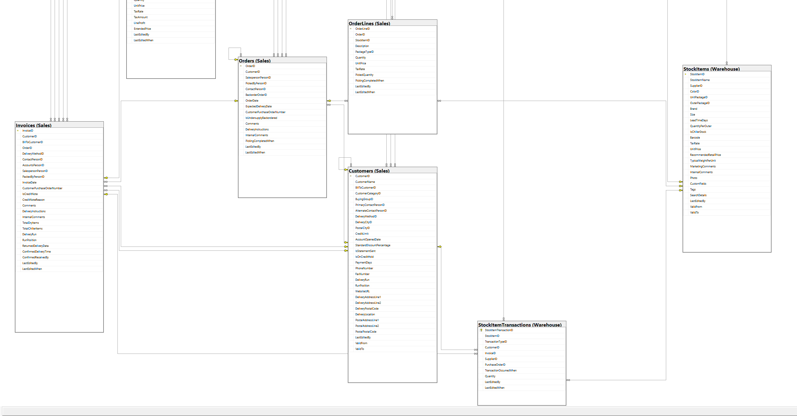
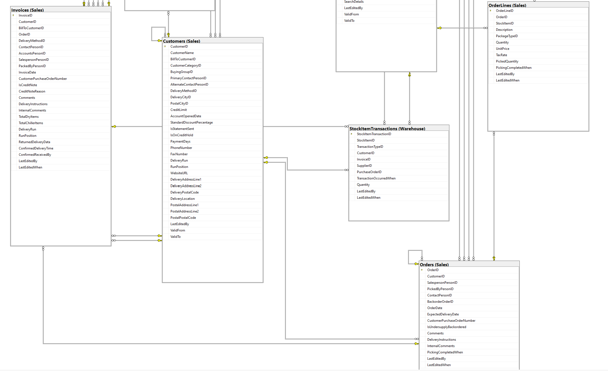

# itudb2244

# How to Run

`python3 server.py`

# Architecture
## Service
SQL query generators reside in `services/service.py` which can be inherited by any table service class. Add, Update, Delete and Get methods of the parent class Service can be inherited by each table. They use objects in models to get information about columns. 
## Models
Tables' columns are stored in `models.py` as reference. It is used by services to generate queries. 
## Server
Url endpoints are declared in `server.py`. It is responsible to run the server. View functions are assigned to urls.
## Views
View functions are declared in `views.py`. It is responsible for connecting services with appropriate url's and template files which create html.
## Templates
Jinja templates are in `templates/` directory. Jinja macro `templates/list_macro.html` is responsible of serving appropriate html file depending on the context and data. 
## Tables
CSV files are stored in `Tables/` to have common source of data at database creation.

# Database Creation
Running `import_tables.sh` will read the csv files at `Tables/` and create `import_test.db` file at project root directory.

`./import_tables.sh`

CSV files at `Tables/` directory are distilled versions of csv's at `Tables/full_backup` directory. To remove elements `drop_unnecessary.sql` is run. To reset csv's that the database uses run:

`./import_bulk.sh`

Files with `.db` and `.sqlite` will stay at local and not sync with git.

# Data Source
A subset of Microsoft's World Wide Importers data was used. CSV's were extracted and placed in Tables directory. Below you can see the relationship diagram of the data used.

